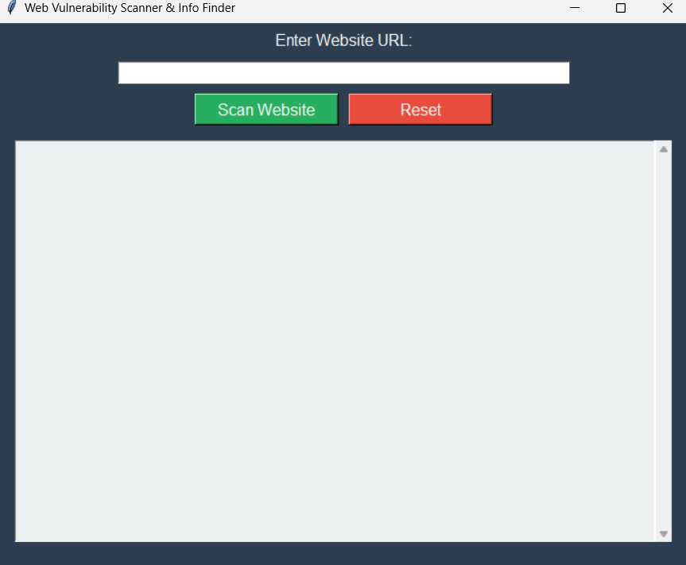
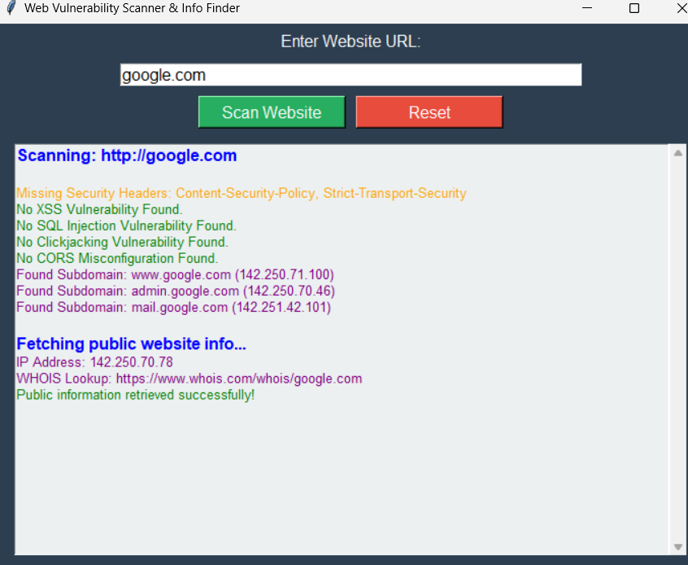

# Web Vulnerability Scanner 🔍

A Python-based Web Vulnerability Scanner with GUI to detect security flaws like XSS, SQL Injection, Clickjacking, CORS Misconfiguration, and more.

## Features ✨
- ✅ Detects **XSS, SQL Injection, Clickjacking, CORS issues**
- ✅ Scans for **security headers**
- ✅ Retrieves **public information (IP, WHOIS, subdomains)**
- ✅ Interactive **Tkinter GUI** with colored output
- ✅ Auto-update results when URL changes

## Installation 🛠️
1.Clone the repository:
   git clone https://github.com/YOUR_USERNAME/WebVulnScanner.git

2. Navigate into the project folder:
    cd WebVulnScanner

3. Install dependencies:
    pip install -r requirements.txt
    
4.Run the scanner:
    python BugFinder.py

Usage 📖
Enter the website URL in the input field.

Click "Scan Website" to detect vulnerabilities.

Click "Reset" to clear results.

Screenshots 📸
Scanner UI

Vulnerability Scan Results

Contributing 🤝
Feel free to submit issues or pull requests if you find bugs or have feature suggestions!

License 📜
This project is open-source and free to use under the MIT License.